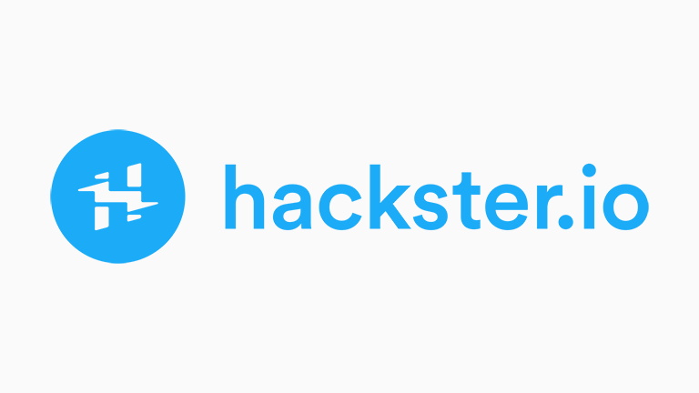
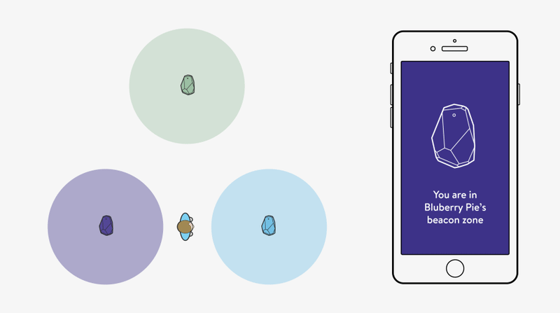
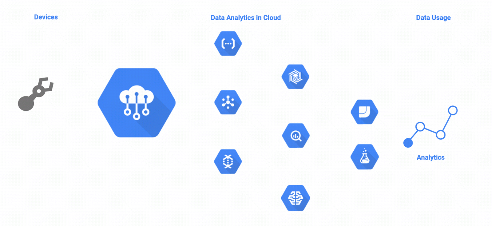
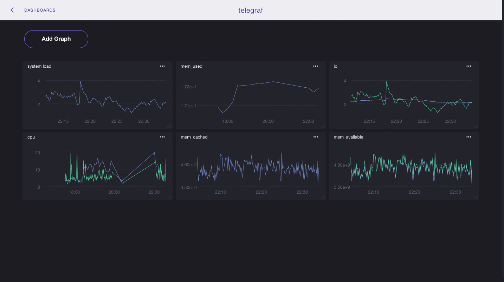

# **Gym Attendance Monitoring**

<a href="https://www.dis.uniroma1.it/" title="DIAG"></a>

**Gym Attendance Monitoring** is a proof of concept of an android application which tracks the user through the gym to monitor the use of the rooms and to have a customer loyalty system. 
The project is part of the [***Internet of Things course***](http://ichatz.me/Site/InternetOfThings2019) held at [***Sapienza University of Rome***](https://www.uniroma1.it/it).

For the correct functioning it is necessary to own the Estimote branded beacons; Microsoft Azure and Grafana technologies will also be used.

* **Authors**:
<br/>- *Andrea Littera* <a href="https://github.com/alittera" title="GitHub"></a>
<a href="https://www.linkedin.com/in/andrea-littera/" title="LinkedIn"></a>
<br/>- *Gianmarco Cariggi* <a href="https://github.com/giacar" title="GitHub"></a>
<a href="https://www.linkedin.com/in/gianmarco-cariggi/" title="LinkedIn"></a>
<br/>- *Marco Costa* <a href="https://github.com/marcocosta96" title="GitHub"></a>
<a href="https://www.linkedin.com/in/marco-costa-ecs" title="LinkedIn"></a>

* **Technologies**:
<br/><div style="float: left; text-align: center; padding-right: 20px;">[Estimote Beacons](https://estimote.com/)<br/><a href="https://estimote.com/" title="Estimote"></a></div><div style="float: left"></div><div style="float: left; text-align: center">[Android SDK](https://developer.android.com/)<br/><a href="https://developer.android.com/" title="Android"></div><div style="clear: both"></div><div style="float: left; text-align: center; padding-right: 30px;">[Azure IoT Hub](https://azure.microsoft.com/en-us/services/iot-hub/)<br/><a href="https://azure.microsoft.com/en-us/services/iot-hub/" title="Azure"></a></div><div style="float: left; text-align: center">[Grafana](https://grafana.com/)<br/><a href="https://grafana.com/" title="Grafana"></a></div><div style="clear: both"></div>

* **Presentations**:
<br/><pre>     **Preliminary Presentation**                        **Final Presentation**
<br/><a href="https://www.slideshare.net/AndreaLittera1/connected-gym" title="Preliminary Presentation"></a> <a href="https://www.slideshare.net/AndreaLittera1/connected-gym-final-presentation" title="Final Presentation"></a></pre>

* **Blog post**:
<br/><pre>                    **Hackster**
<br/><a href="https://www.hackster.io/151941/gym-attendance-monitoring-via-beacon-123eef" title="Hackster Blog"></a></pre>

## **How does it work**

### **Track User** 


GPS cannot be used to track a user inside a building. This requires a different solution. The best method is to use beacons, ***Bluetooth Low Energy*** (***BLE***) components that communicate their presence to the devices around it. It is powered by a non-replaceable lithium battery. They work like a lighthouse, so your smartphone can know which is the nearest one. For our purpose, we have used the ***Estimote Beacons***. We have associated a room with each beacon, so you can know which room the user is in. To integrate them into the application, [***Estimote SDK***](https://github.com/Estimote/Android-Fleet-Management-SDK) have been used.

### **Store and analyse data**


To store user data from the application, you need to store it in a database on the cloud. To do this we used ***Azure IoT Hub***, an open and flexible cloud platform as a service that supports open-source SDKs and multiple protocols. This makes it possible to securely connect, monitor, and manage billions of devices to develop Internet of Things applications. Two databases were used: the first one for user's data and the second one for events (entrance to a room, change of room, abandonment of the room...). The data is sent by the application to Azure thanks to [***Azure IoT SDKs***](https://github.com/Azure/azure-iot-sdks).

### **Graphicize the analyzed data**


To graph the data stored on Azure, we used ***Grafana***,an open-source, general purpose dashboard and graph composer, which runs as a web application. Thanks to the [***Azure Monitoring plugin for Grafana***](https://grafana.com/plugins/grafana-azure-monitor-datasource), it's possible to queries Azure SQL database to create statics useful for gym's owner.

## **Installation**
### **First step: configure project**
* Import ***ConnectedGym*** folder as project into Android Studio.
* In ***MainActivity.java***, replace *room_#* with the minor number of your *Beacons*.
### **Second step: register device on Azure IoT Hub**
* Download ***Azure Cloud Shell***
* Login to Azure from command line:
```
$: az login
```
* Register your device on the Azure IoT Hub platform:
```
$: az extension add --name azure-cli-iot-ext
$: az iot hub device-identity create --hub-name YourIoTHubName --device-id MyAndroidDevice
```
where ```YourIoTHubName``` is the name of the device registered on the azure iot hub platform.
### **Third step: obtain the connection string for your device**
```
$: az iot hub device-identity show-connection-string --hub-name YourIoTHubName --device-id MyAndroidDevice --output table
```
### **Fourth step: send data to Azure IoT Hub platform**
* Put the connection string obtained in ***step 3*** in the file ***gradle.properties***
* App will send data automatically if configured
* In order to check if data are sent to azure iot hub you can check this from the azure cloud shell with the following command:
```
$: az iot hub monitor-events --hub-name YourIoTHubName --output table
```
### **Run Android App**
* Make sure your Android device is connected to your computer via a USB cable.
* Connect the device to WiFi/UMTS network that allows for communication with the server. 
* Make sure your device is set up for ***development*** as explained [here](https://developer.android.com/training/basics/firstapp/running-app#RealDevice).
* Change ***USB mode*** to data transfer and allow the ***RSA fingerprint*** request of access if asked.
* Click on run button on Android Studio GUI and select your device.


Alternatively you can use ***adb*** from shell ([How to do it](http://delphi.org/2013/11/installing-and-running-android-apps-from-command-line/))

N.B.
You cannot run the app through android studio emulator due to the lack of bluetooth connection.  

## **How to use the app**
* Launch the application on your smartphone
* Grant location permissions
* Turn on **Bluetooth** and **GPS**
* Enter your details in **Account** section
* Click **Save**